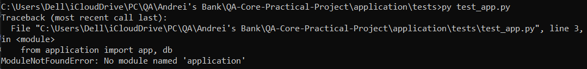

# QA-Core-Practical-Project
Flask application for the QA Core Practical Project. An web app called "Andrei's Bank", which simulates transactions and currency conversions in EUR, GBP &amp; USD.

# Design
For the project design I started out by writing down different ideas and then coming to a decision as to which one I wanted to carry on with by process of elimination. Then I consulted with my trainer and refined this idea.

## Front-end
The front end of the application is using most of the styling CSS from the first QA project that I completed which I adapted for this project. This involved HTML and CSS.

## Back-end
For the back end of the website I'm using the Python Flask framework alongside various libraries.

## User Journey
The user is able to register for "Andrei's Bank" by providing their details on the register page. Then, they'll be able to login immediately after. This allows the user access to their "MyAccount" page where they can view their personal details alongside their account balances. Each user has by default three bank accounts attached to their user account - a USD, a GBP and a EUR account. The user is able to deposit more money into any of their currency accounts by clicking "deposit", selecting which currency and entering the ammount. On the Currency Exchange page, the user is able to exchange any of their currency balances into another currency using the latest exchange rates. This is powered by an external API from "currencyexchange.io". The user is then also able to withdraw or transfer any funds they have. Transferring works by transferring the funds to another account at Andrei's Bank using the account number.

## User Journey - Behind the scenes work
In order for the website to work as described, the following had to be implemented: a relational database, random account number generation, database queries, external API requests and API response data handling. I also had to implement some level of data validation although this isn't 100% yet. Flask SQLAlchemy was used for the relational database. Flask sessions was used heavily throughout for keeping the user logged in and storing some data throughout the browsing session, in order to display it to the user.

## ERD Diagram

# Project Tracking
For this project, I used Trello to map out the tasks required for the duration of the project. I split these up into 8 categories - Backlog, To-do, Doing, Design, Code Review, Testing and Done. This was in order to be able to clearly see which tasks require most priority and so that they are well organised.

# Risk Assessment

# Known Issues
- Currently a user can transfer the wrong currency into another user's account. For example 10 GBP can go into the USD or EUR account of another user. I'd like to make it so that the app blocks this and tells the user to convert the currency before transferring.

# Future Improvements
In the future I'd like to: 
- Deploy the application to a cloud storage provider.
- Fix the Flask Testing as I had some issues with this (screenshot below)
- Improve front-end to make the website more user friendly

